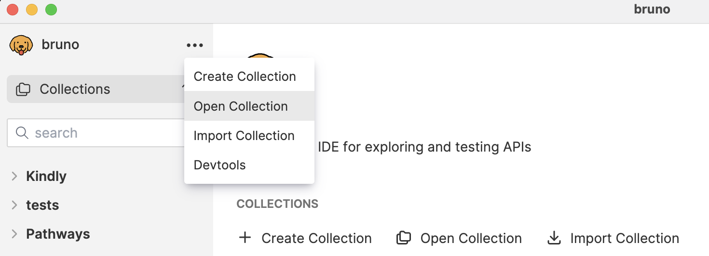
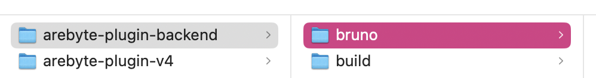
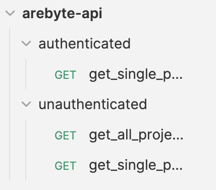

## Setup

This codebase uses [bruno](https://docs.usebruno.com/testing/introduction) to test all endpoints which are exposed to the frontend.

In order to allow for automation and help us avoid regression we have integrated all tests into the code base. You can access all test scripts directly in your IDE or through the Bruno app.

To access all tests from within Bruno:

- open the app and on the top-left corner select `open collection`

  
- select the folder `bruno` within your local repo

  
- a new collection called `arebyte-api` will be displayed in Bruno

  

## Editing tests

Once this has been set up you can edit tests and track changes along with the rest of the code base.

All tests can now be edited through the Bruno GUI or in the IDE.
Any edits made to the `.bru` files will be tracked by your Bruno GUI.

## Running the tests

The bruno cli is one of the dev dependencies in this project and we have prepared a simple script that will run all tests:

```bash
npm run test
```
Please keep in mind that the server must be running.
